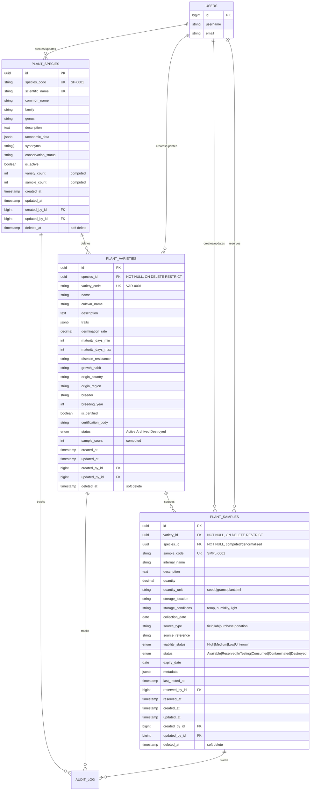

# Hierarchical Plant Inventory System Design

## Species → Variety → Sample

**Purpose:** Complete architectural specification for a three-tier hierarchical plant inventory system with strict parent-child relationships, referential integrity, cascading behaviors, and comprehensive UI/UX patterns.

**Version:** 1.0  
**Created:** 2026-02-16  
**Status:** ✅ Complete Specification

---

## Table of Contents

1. [System Overview](#system-overview)
2. [Hierarchical Architecture](#hierarchical-architecture)
3. [Data Model & Schema](#data-model--schema)
4. [TypeScript Type System](#typescript-type-system)
5. [Business Logic & Validation Rules](#business-logic--validation-rules)
6. [Unique Code Generation](#unique-code-generation)
7. [API Design & Endpoints](#api-design--endpoints)
8. [UI/UX Patterns](#uiux-patterns)
9. [State Management](#state-management)
10. [Search & Filtering](#search--filtering)
11. [Bulk Operations](#bulk-operations)
12. [Migration Strategy](#migration-strategy)
13. [Performance Optimization](#performance-optimization)
14. [Security & Permissions](#security--permissions)

---

## System Overview

### Design Philosophy

**Hierarchical Integrity:** Every entity exists within a strict three-tier hierarchy where:

- **Species** are top-level taxonomic entities (independent, no parent)
- **Varieties** are genetic variants that MUST belong to a Species (cannot exist without parent)
- **Samples** are physical inventory units that MUST belong to a Variety (and transitively to a Species)

**Key Principles:**

1. **Referential Integrity:** Foreign keys enforced at database level
2. **Cascade Awareness:** Deleting parents affects children (with safeguards)
3. **Breadcrumb Navigation:** Always show full hierarchy path
4. **Type Safety:** Compile-time guarantees for relationships
5. **Auditability:** Complete change tracking at all levels

---

## Hierarchical Architecture

### Entity Relationship Model



### Hierarchy Visualization

```
Species (Solanum lycopersicum)
├── Variety (Cherokee Purple)
│   ├── Sample (SMPL-0001) - 500g seeds
│   ├── Sample (SMPL-0002) - 200g seeds
│   └── Sample (SMPL-0003) - 100 plants
│
├── Variety (San Marzano)
│   ├── Sample (SMPL-0004) - 1kg seeds
│   └── Sample (SMPL-0005) - 50 plants
│
└── Variety (Roma VF)
    └── Sample (SMPL-0006) - 300g seeds
```

---

## Data Model & Schema

### PostgreSQL Schema (Complete)

```sql
-- ═══════════════════════════════════════════════════════════════════════════
--  ENUMS & TYPES
-- ═══════════════════════════════════════════════════════════════════════════

CREATE TYPE variety_status AS ENUM ('Active', 'Archived', 'Destroyed');

CREATE TYPE sample_status AS ENUM (
  'Available',
  'Reserved',
  'InTesting',
  'Consumed',
  'Contaminated',
  'Destroyed'
);

CREATE TYPE viability_status AS ENUM ('High', 'Medium', 'Low', 'Unknown');

CREATE TYPE source_type AS ENUM ('Field', 'Lab', 'Purchase', 'Donation', 'Exchange');

-- ═══════════════════════════════════════════════════════════════════════════
--  TABLE: plant_species (TOP LEVEL)
-- ═══════════════════════════════════════════════════════════════════════════

CREATE TABLE plant_species (
  id UUID PRIMARY KEY DEFAULT gen_random_uuid(),

  -- Identification
  species_code VARCHAR(20) UNIQUE NOT NULL, -- SP-0001, SP-0002, etc.
  scientific_name VARCHAR(255) UNIQUE NOT NULL,
  common_name VARCHAR(255) NOT NULL,

  -- Taxonomy
  family VARCHAR(100),
  genus VARCHAR(100),
  species VARCHAR(100),
  taxonomic_data JSONB DEFAULT '{}',
  synonyms TEXT[] DEFAULT '{}',

  -- Conservation
  conservation_status VARCHAR(50), -- LC, NT, VU, EN, CR, EW, EX

  -- Administrative
  description TEXT,
  is_active BOOLEAN DEFAULT true,

  -- Computed fields (updated via triggers)
  variety_count INT DEFAULT 0,
  sample_count INT DEFAULT 0,

  -- Audit fields
  created_at TIMESTAMP WITH TIME ZONE DEFAULT now() NOT NULL,
  updated_at TIMESTAMP WITH TIME ZONE DEFAULT now() NOT NULL,
  created_by_id BIGINT REFERENCES users(id),
  updated_by_id BIGINT REFERENCES users(id),
  deleted_at TIMESTAMP WITH TIME ZONE, -- soft delete

  -- Constraints
  CONSTRAINT species_code_format CHECK (species_code ~ '^SP-\d{4,}$')
);

-- Indexes
CREATE INDEX idx_species_scientific_name ON plant_species(scientific_name) WHERE deleted_at IS NULL;
CREATE INDEX idx_species_common_name ON plant_species(common_name) WHERE deleted_at IS NULL;
CREATE INDEX idx_species_family ON plant_species(family) WHERE deleted_at IS NULL;
CREATE INDEX idx_species_active ON plant_species(is_active) WHERE deleted_at IS NULL;
CREATE INDEX idx_species_deleted ON plant_species(deleted_at) WHERE deleted_at IS NOT NULL;

-- Full text search
CREATE INDEX idx_species_search ON plant_species
  USING gin(to_tsvector('english',
    coalesce(scientific_name, '') || ' ' ||
    coalesce(common_name, '') || ' ' ||
    coalesce(description, '')
  ))
  WHERE deleted_at IS NULL;

-- Comments
COMMENT ON TABLE plant_species IS 'Top-level taxonomic species catalog';
COMMENT ON COLUMN plant_species.species_code IS 'Human-readable unique identifier (SP-0001)';
COMMENT ON COLUMN plant_species.variety_count IS 'Computed count of non-deleted varieties';
COMMENT ON COLUMN plant_species.sample_count IS 'Computed total samples across all varieties';

-- ═══════════════════════════════════════════════════════════════════════════
--  TABLE: plant_varieties (MIDDLE LEVEL)
-- ═══════════════════════════════════════════════════════════════════════════

CREATE TABLE plant_varieties (
  id UUID PRIMARY KEY DEFAULT gen_random_uuid(),

  -- Hierarchy (REQUIRED parent)
  species_id UUID NOT NULL REFERENCES plant_species(id) ON DELETE RESTRICT,

  -- Identification
  variety_code VARCHAR(20) UNIQUE NOT NULL, -- VAR-0001
  name VARCHAR(255) NOT NULL,
  cultivar_name VARCHAR(255),

  -- Genetic/Trait information
  description TEXT,
  traits JSONB DEFAULT '{}', -- {color, size, flavor, yield, etc.}
  germination_rate DECIMAL(5,2) CHECK (germination_rate >= 0 AND germination_rate <= 100),
  maturity_days_min INT CHECK (maturity_days_min > 0),
  maturity_days_max INT CHECK (maturity_days_max >= maturity_days_min),
  disease_resistance TEXT,
  growth_habit VARCHAR(100), -- determinate, indeterminate, bush, vine, etc.

  -- Origin
  origin_country VARCHAR(100),
  origin_region VARCHAR(255),
  breeder VARCHAR(255),
  breeding_year INT CHECK (breeding_year >= 1500 AND breeding_year <= EXTRACT(YEAR FROM CURRENT_DATE)),

  -- Certification
  is_certified BOOLEAN DEFAULT false,
  certification_body VARCHAR(255),

  -- Status
  status variety_status NOT NULL DEFAULT 'Active',

  -- Computed fields
  sample_count INT DEFAULT 0,

  -- Audit fields
  created_at TIMESTAMP WITH TIME ZONE DEFAULT now() NOT NULL,
  updated_at TIMESTAMP WITH TIME ZONE DEFAULT now() NOT NULL,
  created_by_id BIGINT REFERENCES users(id),
  updated_by_id BIGINT REFERENCES users(id),
  deleted_at TIMESTAMP WITH TIME ZONE,

  -- Constraints
  CONSTRAINT variety_code_format CHECK (variety_code ~ '^VAR-\d{4,}$'),
  CONSTRAINT variety_name_species_unique UNIQUE (species_id, name, deleted_at)
);

-- Indexes
CREATE INDEX idx_variety_species ON plant_varieties(species_id) WHERE deleted_at IS NULL;
CREATE INDEX idx_variety_status ON plant_varieties(status) WHERE deleted_at IS NULL;
CREATE INDEX idx_variety_name ON plant_varieties(name) WHERE deleted_at IS NULL;
CREATE INDEX idx_variety_deleted ON plant_varieties(deleted_at) WHERE deleted_at IS NOT NULL;

-- Full text search
CREATE INDEX idx_variety_search ON plant_varieties
  USING gin(to_tsvector('english',
    coalesce(name, '') || ' ' ||
    coalesce(cultivar_name, '') || ' ' ||
    coalesce(description, '')
  ))
  WHERE deleted_at IS NULL;

-- Comments
COMMENT ON TABLE plant_varieties IS 'Middle-tier genetic varieties belonging to species';
COMMENT ON COLUMN plant_varieties.species_id IS 'Required parent species (cannot be null)';
COMMENT ON COLUMN plant_varieties.variety_code IS 'Human-readable unique identifier (VAR-0001)';

-- ═══════════════════════════════════════════════════════════════════════════
--  TABLE: plant_samples (LOWEST LEVEL)
-- ═══════════════════════════════════════════════════════════════════════════

CREATE TABLE plant_samples (
  id UUID PRIMARY KEY DEFAULT gen_random_uuid(),

  -- Hierarchy (REQUIRED parent)
  variety_id UUID NOT NULL REFERENCES plant_varieties(id) ON DELETE RESTRICT,
  species_id UUID NOT NULL, -- Denormalized for performance (set via trigger)

  -- Identification
  sample_code VARCHAR(20) UNIQUE NOT NULL, -- SMPL-0001
  internal_name VARCHAR(255),
  description TEXT,

  -- Quantity & Storage
  quantity DECIMAL(12,4) NOT NULL CHECK (quantity >= 0),
  quantity_unit VARCHAR(50) NOT NULL DEFAULT 'units', -- seeds, grams, plants, ml, etc.
  storage_location VARCHAR(255),
  storage_conditions TEXT, -- "4°C, 60% RH, dark"

  -- Source & Provenance
  collection_date DATE,
  source_type source_type NOT NULL,
  source_reference VARCHAR(255), -- PO number, donor name, field plot ID, etc.

  -- Quality & Viability
  viability_status viability_status DEFAULT 'Unknown',
  expiry_date DATE,
  last_tested_at TIMESTAMP WITH TIME ZONE,

  -- Status & Reservation
  status sample_status NOT NULL DEFAULT 'Available',
  reserved_by_id BIGINT REFERENCES users(id),
  reserved_at TIMESTAMP WITH TIME ZONE,

  -- Metadata
  metadata JSONB DEFAULT '{}', -- flexible field for custom data

  -- Audit fields
  created_at TIMESTAMP WITH TIME ZONE DEFAULT now() NOT NULL,
  updated_at TIMESTAMP WITH TIME ZONE DEFAULT now() NOT NULL,
  created_by_id BIGINT REFERENCES users(id),
  updated_by_id BIGINT REFERENCES users(id),
  deleted_at TIMESTAMP WITH TIME ZONE,

  -- Constraints
  CONSTRAINT sample_code_format CHECK (sample_code ~ '^SMPL-\d{4,}$'),
  CONSTRAINT positive_quantity CHECK (quantity >= 0),
  CONSTRAINT valid_reservation CHECK (
    (status = 'Reserved' AND reserved_by_id IS NOT NULL AND reserved_at IS NOT NULL) OR
    (status != 'Reserved' AND reserved_by_id IS NULL AND reserved_at IS NULL)
  )
);

-- Indexes
CREATE INDEX idx_sample_variety ON plant_samples(variety_id) WHERE deleted_at IS NULL;
CREATE INDEX idx_sample_species ON plant_samples(species_id) WHERE deleted_at IS NULL;
CREATE INDEX idx_sample_status ON plant_samples(status) WHERE deleted_at IS NULL;
CREATE INDEX idx_sample_viability ON plant_samples(viability_status) WHERE deleted_at IS NULL;
CREATE INDEX idx_sample_reserved ON plant_samples(reserved_by_id) WHERE deleted_at IS NULL AND status = 'Reserved';
CREATE INDEX idx_sample_storage ON plant_samples(storage_location) WHERE deleted_at IS NULL;
CREATE INDEX idx_sample_deleted ON plant_samples(deleted_at) WHERE deleted_at IS NOT NULL;

-- Full text search
CREATE INDEX idx_sample_search ON plant_samples
  USING gin(to_tsvector('english',
    coalesce(internal_name, '') || ' ' ||
    coalesce(description, '') || ' ' ||
    coalesce(storage_location, '')
  ))
  WHERE deleted_at IS NULL;

-- Comments
COMMENT ON TABLE plant_samples IS 'Lowest-tier physical inventory samples';
COMMENT ON COLUMN plant_samples.variety_id IS 'Required parent variety (cannot be null)';
COMMENT ON COLUMN plant_samples.species_id IS 'Denormalized from variety.species_id (auto-populated)';
COMMENT ON COLUMN plant_samples.sample_code IS 'Human-readable unique identifier (SMPL-0001)';

-- ═══════════════════════════════════════════════════════════════════════════
--  TRIGGERS
-- ═══════════════════════════════════════════════════════════════════════════

-- Auto-update updated_at timestamp
CREATE OR REPLACE FUNCTION update_updated_at()
RETURNS TRIGGER AS $$
BEGIN
  NEW.updated_at = now();
  RETURN NEW;
END;
$$ LANGUAGE plpgsql;

CREATE TRIGGER trg_species_updated_at BEFORE UPDATE ON plant_species
  FOR EACH ROW EXECUTE FUNCTION update_updated_at();

CREATE TRIGGER trg_variety_updated_at BEFORE UPDATE ON plant_varieties
  FOR EACH ROW EXECUTE FUNCTION update_updated_at();

CREATE TRIGGER trg_sample_updated_at BEFORE UPDATE ON plant_samples
  FOR EACH ROW EXECUTE FUNCTION update_updated_at();

-- Auto-populate species_id in samples (denormalization)
CREATE OR REPLACE FUNCTION populate_sample_species_id()
RETURNS TRIGGER AS $$
BEGIN
  SELECT species_id INTO NEW.species_id
  FROM plant_varieties
  WHERE id = NEW.variety_id;

  IF NEW.species_id IS NULL THEN
    RAISE EXCEPTION 'Cannot find species for variety %', NEW.variety_id;
  END IF;

  RETURN NEW;
END;
$$ LANGUAGE plpgsql;

CREATE TRIGGER trg_sample_species_id
  BEFORE INSERT OR UPDATE OF variety_id ON plant_samples
  FOR EACH ROW
  EXECUTE FUNCTION populate_sample_species_id();

-- Update variety_count on plant_species
CREATE OR REPLACE FUNCTION update_species_variety_count()
RETURNS TRIGGER AS $$
BEGIN
  IF TG_OP = 'INSERT' AND NEW.deleted_at IS NULL THEN
    UPDATE plant_species
    SET variety_count = variety_count + 1
    WHERE id = NEW.species_id;
  ELSIF TG_OP = 'DELETE' AND OLD.deleted_at IS NULL THEN
    UPDATE plant_species
    SET variety_count = variety_count - 1
    WHERE id = OLD.species_id;
  ELSIF TG_OP = 'UPDATE' THEN
    IF OLD.deleted_at IS NULL AND NEW.deleted_at IS NOT NULL THEN
      UPDATE plant_species SET variety_count = variety_count - 1 WHERE id = OLD.species_id;
    ELSIF OLD.deleted_at IS NOT NULL AND NEW.deleted_at IS NULL THEN
      UPDATE plant_species SET variety_count = variety_count + 1 WHERE id = NEW.species_id;
    END IF;
  END IF;
  RETURN NULL;
END;
$$ LANGUAGE plpgsql;

CREATE TRIGGER trg_variety_count
  AFTER INSERT OR UPDATE OR DELETE ON plant_varieties
  FOR EACH ROW
  EXECUTE FUNCTION update_species_variety_count();

-- Update sample_count on plant_varieties
CREATE OR REPLACE FUNCTION update_variety_sample_count()
RETURNS TRIGGER AS $$
BEGIN
  IF TG_OP = 'INSERT' AND NEW.deleted_at IS NULL THEN
    UPDATE plant_varieties
    SET sample_count = sample_count + 1
    WHERE id = NEW.variety_id;
  ELSIF TG_OP = 'DELETE' AND OLD.deleted_at IS NULL THEN
    UPDATE plant_varieties
    SET sample_count = sample_count - 1
    WHERE id = OLD.variety_id;
  ELSIF TG_OP = 'UPDATE' THEN
    IF OLD.deleted_at IS NULL AND NEW.deleted_at IS NOT NULL THEN
      UPDATE plant_varieties SET sample_count = sample_count - 1 WHERE id = OLD.variety_id;
    ELSIF OLD.deleted_at IS NOT NULL AND NEW.deleted_at IS NULL THEN
      UPDATE plant_varieties SET sample_count = sample_count + 1 WHERE id = NEW.variety_id;
    END IF;
  END IF;
  RETURN NULL;
END;
$$ LANGUAGE plpgsql;

CREATE TRIGGER trg_sample_count
  AFTER INSERT OR UPDATE OR DELETE ON plant_samples
  FOR EACH ROW
  EXECUTE FUNCTION update_variety_sample_count();

-- Update sample_count on plant_species (rollup)
CREATE OR REPLACE FUNCTION update_species_sample_count()
RETURNS TRIGGER AS $$
BEGIN
  IF TG_OP = 'INSERT' AND NEW.deleted_at IS NULL THEN
    UPDATE plant_species
    SET sample_count = sample_count + 1
    WHERE id = NEW.species_id;
  ELSIF TG_OP = 'DELETE' AND OLD.deleted_at IS NULL THEN
    UPDATE plant_species
    SET sample_count = sample_count - 1
    WHERE id = OLD.species_id;
  ELSIF TG_OP = 'UPDATE' THEN
    IF OLD.deleted_at IS NULL AND NEW.deleted_at IS NOT NULL THEN
      UPDATE plant_species SET sample_count = sample_count - 1 WHERE id = OLD.species_id;
    ELSIF OLD.deleted_at IS NOT NULL AND NEW.deleted_at IS NULL THEN
      UPDATE plant_species SET sample_count = sample_count + 1 WHERE id = NEW.species_id;
    END IF;
  END IF;
  RETURN NULL;
END;
$$ LANGUAGE plpgsql;

CREATE TRIGGER trg_species_sample_count
  AFTER INSERT OR UPDATE OR DELETE ON plant_samples
  FOR EACH ROW
  EXECUTE FUNCTION update_species_sample_count();
```

---

## TypeScript Type System

### Core Interfaces

```typescript
// ═══════════════════════════════════════════════════════════════════════════
//  BASE TYPES
// ═══════════════════════════════════════════════════════════════════════════

export interface Auditable {
  createdAt: string;
  updatedAt: string;
  createdById?: number;
  updatedById?: number;
  deletedAt?: string | null;
}

export interface HierarchicalEntity extends Auditable {
  id: string;
  // Hierarchy methods
  getParent(): Promise<HierarchicalEntity | null>;
  getChildren(): Promise<HierarchicalEntity[]>;
  getAncestors(): Promise<HierarchicalEntity[]>;
  getBreadcrumb(): string[];
}

// ═══════════════════════════════════════════════════════════════════════════
//  ENUMS & STATUS TYPES
// ═══════════════════════════════════════════════════════════════════════════

export type VarietyStatus = "Active" | "Archived" | "Destroyed";

export type SampleStatus =
  | "Available"
  | "Reserved"
  | "InTesting"
  | "Consumed"
  | "Contaminated"
  | "Destroyed";

export type ViabilityStatus = "High" | "Medium" | "Low" | "Unknown";

export type SourceType = "Field" | "Lab" | "Purchase" | "Donation" | "Exchange";

export type ConservationStatus = "LC" | "NT" | "VU" | "EN" | "CR" | "EW" | "EX";

// ═══════════════════════════════════════════════════════════════════════════
//  PLANT SPECIES (TOP LEVEL)
// ═══════════════════════════════════════════════════════════════════════════

export interface TaxonomicData {
  kingdom?: string;
  phylum?: string;
  class?: string;
  order?: string;
  family?: string;
  genus?: string;
  species?: string;
  subspecies?: string;
}

export interface PlantSpecies extends Auditable {
  id: string;

  // Identification
  speciesCode: string; // SP-0001
  scientificName: string;
  commonName: string;

  // Taxonomy
  family?: string;
  genus?: string;
  species?: string;
  taxonomicData?: TaxonomicData;
  synonyms?: string[];

  // Conservation
  conservationStatus?: ConservationStatus;

  // Administrative
  description?: string;
  isActive: boolean;

  // Computed (read-only)
  varietyCount: number;
  sampleCount: number;

  // Relations (lazy-loaded)
  varieties?: PlantVariety[];
}

// ═══════════════════════════════════════════════════════════════════════════
//  PLANT VARIETY (MIDDLE LEVEL)
// ═══════════════════════════════════════════════════════════════════════════

export interface VarietyTraits {
  color?: string;
  size?: string;
  flavor?: string;
  yield?: string;
  [key: string]: any; // Extensible
}

export interface PlantVariety extends Auditable {
  id: string;

  // Hierarchy (REQUIRED)
  speciesId: string;

  // Identification
  varietyCode: string; // VAR-0001
  name: string;
  cultivarName?: string;

  // Genetic/Trait information
  description?: string;
  traits?: VarietyTraits;
  germinationRate?: number; // 0-100
  maturityDaysMin?: number;
  maturityDaysMax?: number;
  diseaseResistance?: string;
  growthHabit?: string;

  // Origin
  originCountry?: string;
  originRegion?: string;
  breeder?: string;
  breedingYear?: number;

  // Certification
  isCertified: boolean;
  certificationBody?: string;

  // Status
  status: VarietyStatus;

  // Computed (read-only)
  sampleCount: number;

  // Relations (lazy-loaded)
  species?: PlantSpecies;
  samples?: PlantSample[];
}

// ═══════════════════════════════════════════════════════════════════════════
//  PLANT SAMPLE (LOWEST LEVEL)
// ═══════════════════════════════════════════════════════════════════════════

export interface SampleMetadata {
  [key: string]: any; // Completely flexible
}

export interface PlantSample extends Auditable {
  id: string;

  // Hierarchy (REQUIRED)
  varietyId: string;
  speciesId: string; // Denormalized (auto-populated)

  // Identification
  sampleCode: string; // SMPL-0001
  internalName?: string;
  description?: string;

  // Quantity & Storage
  quantity: number;
  quantityUnit: string; // seeds, grams, plants, ml
  storageLocation?: string;
  storageConditions?: string;

  // Source & Provenance
  collectionDate?: string;
  sourceType: SourceType;
  sourceReference?: string;

  // Quality & Viability
  viabilityStatus: ViabilityStatus;
  expiryDate?: string;
  lastTestedAt?: string;

  // Status & Reservation
  status: SampleStatus;
  reservedById?: number;
  reservedAt?: string;

  // Metadata
  metadata?: SampleMetadata;

  // Relations (lazy-loaded)
  variety?: PlantVariety;
  species?: PlantSpecies;
  reservedBy?: User;
}

// ═══════════════════════════════════════════════════════════════════════════
//  BREADCRUMB & NAVIGATION TYPES
// ═══════════════════════════════════════════════════════════════════════════

export interface BreadcrumbItem {
  level: "species" | "variety" | "sample";
  id: string;
  label: string;
  code: string;
  url: string;
}

export interface HierarchyPath {
  species: PlantSpecies;
  variety?: PlantVariety;
  sample?: PlantSample;
  breadcrumbs: BreadcrumbItem[];
}

// ═══════════════════════════════════════════════════════════════════════════
//  FORM & VALIDATION TYPES
// ═══════════════════════════════════════════════════════════════════════════

export interface CreateSpeciesInput {
  scientificName: string;
  commonName: string;
  family?: string;
  genus?: string;
  description?: string;
  conservationStatus?: ConservationStatus;
  taxonomicData?: TaxonomicData;
}

export interface CreateVarietyInput {
  speciesId: string; // REQUIRED
  name: string;
  cultivarName?: string;
  description?: string;
  traits?: VarietyTraits;
  germinationRate?: number;
  maturityDaysMin?: number;
  maturityDaysMax?: number;
  originCountry?: string;
  breeder?: string;
}

export interface CreateSampleInput {
  varietyId: string; // REQUIRED
  internalName?: string;
  description?: string;
  quantity: number;
  quantityUnit: string;
  sourceType: SourceType;
  storageLocation?: string;
  collectionDate?: string;
  viabilityStatus?: ViabilityStatus;
}

// ═══════════════════════════════════════════════════════════════════════════
//  QUERY & FILTER TYPES
// ═══════════════════════════════════════════════════════════════════════════

export interface SpeciesFilters {
  search?: string;
  family?: string;
  isActive?: boolean;
  conservationStatus?: ConservationStatus;
  hasVarieties?: boolean;
}

export interface VarietyFilters {
  search?: string;
  speciesId?: string;
  status?: VarietyStatus;
  isCertified?: boolean;
  originCountry?: string;
  minGerminationRate?: number;
}

export interface SampleFilters {
  search?: string;
  speciesId?: string;
  varietyId?: string;
  status?: SampleStatus;
  viabilityStatus?: ViabilityStatus;
  storageLocation?: string;
  sourceType?: SourceType;
  isReserved?: boolean;
}
```

---

## Business Logic & Validation Rules

### Hierarchical Constraints

```typescript
// ═══════════════════════════════════════════════════════════════════════════
//  VALIDATION RULES
// ═══════════════════════════════════════════════════════════════════════════

export class HierarchyValidator {
  /**
   * RULE 1: Species can be deleted only if it has NO varieties
   */
  static async canDeleteSpecies(speciesId: string): Promise<{
    allowed: boolean;
    reason?: string;
    dependents?: { varieties: number };
  }> {
    const varietyCount = await db.query(
      `
      SELECT COUNT(*) as count 
      FROM plant_varieties 
      WHERE species_id = $1 AND deleted_at IS NULL
    `,
      [speciesId],
    );

    if (varietyCount.rows[0].count > 0) {
      return {
        allowed: false,
        reason: `Cannot delete species: ${varietyCount.rows[0].count} varieties depend on it`,
        dependents: { varieties: varietyCount.rows[0].count },
      };
    }

    return { allowed: true };
  }

  /**
   * RULE 2: Variety can be deleted only if it has NO samples
   */
  static async canDeleteVariety(varietyId: string): Promise<{
    allowed: boolean;
    reason?: string;
    dependents?: { samples: number };
  }> {
    const sampleCount = await db.query(
      `
      SELECT COUNT(*) as count 
      FROM plant_samples 
      WHERE variety_id = $1 AND deleted_at IS NULL
    `,
      [varietyId],
    );

    if (sampleCount.rows[0].count > 0) {
      return {
        allowed: false,
        reason: `Cannot delete variety: ${sampleCount.rows[0].count} samples depend on it`,
        dependents: { samples: sampleCount.rows[0].count },
      };
    }

    return { allowed: true };
  }

  /**
   * RULE 3: Variety MUST have a valid species_id
   */
  static async validateVarietySpecies(speciesId: string): Promise<boolean> {
    const result = await db.query(
      `
      SELECT id FROM plant_species 
      WHERE id = $1 AND deleted_at IS NULL
    `,
      [speciesId],
    );

    return result.rows.length > 0;
  }

  /**
   * RULE 4: Sample MUST have a valid variety_id
   */
  static async validateSampleVariety(varietyId: string): Promise<boolean> {
    const result = await db.query(
      `
      SELECT id FROM plant_varieties 
      WHERE id = $1 AND deleted_at IS NULL
    `,
      [varietyId],
    );

    return result.rows.length > 0;
  }

  /**
   * RULE 5: Germination rate must be 0-100
   */
  static validateGerminationRate(rate?: number): boolean {
    if (rate === undefined || rate === null) return true;
    return rate >= 0 && rate <= 100;
  }

  /**
   * RULE 6: Maturity days max >= min
   */
  static validateMaturityDays(min?: number, max?: number): boolean {
    if (!min && !max) return true;
    if (min && max) return max >= min;
    return true;
  }

  /**
   * RULE 7: Sample quantity must be >= 0
   */
  static validateQuantity(quantity: number): boolean {
    return quantity >= 0;
  }

  /**
   * RULE 8: Reserved samples must have reservedById and reservedAt
   */
  static validateReservation(
    status: SampleStatus,
    reservedById?: number,
    reservedAt?: string,
  ): boolean {
    if (status === "Reserved") {
      return !!reservedById && !!reservedAt;
    } else {
      return !reservedById && !reservedAt;
    }
  }
}

// ═══════════════════════════════════════════════════════════════════════════
//  CASCADE DELETION STRATEGIES
// ═══════════════════════════════════════════════════════════════════════════

export enum DeletionStrategy {
  RESTRICT = "restrict", // Prevent if children exist (default)
  CASCADE = "cascade", // Delete all children recursively
  ORPHAN = "orphan", // Set parent FK to null (not recommended for this hierarchy)
}

export class HierarchyDeletionService {
  /**
   * Delete species with strategy
   * - RESTRICT: Fails if varieties exist
   * - CASCADE: Deletes all varieties and their samples (dangerous!)
   */
  static async deleteSpecies(
    speciesId: string,
    strategy: DeletionStrategy = DeletionStrategy.RESTRICT,
  ): Promise<{
    success: boolean;
    deletedCount?: { varieties: number; samples: number };
  }> {
    if (strategy === DeletionStrategy.RESTRICT) {
      const check = await HierarchyValidator.canDeleteSpecies(speciesId);
      if (!check.allowed) {
        throw new Error(check.reason);
      }

      await db.query(
        `
        UPDATE plant_species 
        SET deleted_at = now() 
        WHERE id = $1
      `,
        [speciesId],
      );

      return { success: true };
    }

    if (strategy === DeletionStrategy.CASCADE) {
      // Get all varieties
      const varieties = await db.query(
        `
        SELECT id FROM plant_varieties 
        WHERE species_id = $1 AND deleted_at IS NULL
      `,
        [speciesId],
      );

      let totalSamples = 0;

      // Delete all samples for each variety
      for (const variety of varieties.rows) {
        const samples = await db.query(
          `
          UPDATE plant_samples 
          SET deleted_at = now() 
          WHERE variety_id = $1 
          RETURNING id
        `,
          [variety.id],
        );

        totalSamples += samples.rowCount;
      }

      // Delete all varieties
      await db.query(
        `
        UPDATE plant_varieties 
        SET deleted_at = now() 
        WHERE species_id = $1
      `,
        [speciesId],
      );

      // Delete species
      await db.query(
        `
        UPDATE plant_species 
        SET deleted_at = now() 
        WHERE id = $1
      `,
        [speciesId],
      );

      return {
        success: true,
        deletedCount: {
          varieties: varieties.rowCount,
          samples: totalSamples,
        },
      };
    }

    throw new Error(`Unsupported deletion strategy: ${strategy}`);
  }

  /**
   * Delete variety with strategy
   */
  static async deleteVariety(
    varietyId: string,
    strategy: DeletionStrategy = DeletionStrategy.RESTRICT,
  ): Promise<{ success: boolean; deletedCount?: { samples: number } }> {
    if (strategy === DeletionStrategy.RESTRICT) {
      const check = await HierarchyValidator.canDeleteVariety(varietyId);
      if (!check.allowed) {
        throw new Error(check.reason);
      }

      await db.query(
        `
        UPDATE plant_varieties 
        SET deleted_at = now() 
        WHERE id = $1
      `,
        [varietyId],
      );

      return { success: true };
    }

    if (strategy === DeletionStrategy.CASCADE) {
      const samples = await db.query(
        `
        UPDATE plant_samples 
        SET deleted_at = now() 
        WHERE variety_id = $1 
        RETURNING id
      `,
        [varietyId],
      );

      await db.query(
        `
        UPDATE plant_varieties 
        SET deleted_at = now() 
        WHERE id = $1
      `,
        [varietyId],
      );

      return {
        success: true,
        deletedCount: { samples: samples.rowCount },
      };
    }

    throw new Error(`Unsupported deletion strategy: ${strategy}`);
  }
}
```

---

## Unique Code Generation

### Auto-incrementing Codes

```typescript
// ═══════════════════════════════════════════════════════════════════════════
//  CODE GENERATION SERVICE
// ═══════════════════════════════════════════════════════════════════════════

export class CodeGenerationService {
  /**
   * Generate next species code: SP-0001, SP-0002, etc.
   */
  static async generateSpeciesCode(): Promise<string> {
    const result = await db.query(`
      SELECT species_code 
      FROM plant_species 
      WHERE species_code ~ '^SP-\d{4,}$'
      ORDER BY species_code DESC 
      LIMIT 1
    `);

    if (result.rows.length === 0) {
      return "SP-0001";
    }

    const lastCode = result.rows[0].species_code;
    const number = parseInt(lastCode.split("-")[1], 10);
    const nextNumber = number + 1;

    return `SP-${nextNumber.toString().padStart(4, "0")}`;
  }

  /**
   * Generate next variety code: VAR-0001, VAR-0002, etc.
   */
  static async generateVarietyCode(): Promise<string> {
    const result = await db.query(`
      SELECT variety_code 
      FROM plant_varieties 
      WHERE variety_code ~ '^VAR-\d{4,}$'
      ORDER BY variety_code DESC 
      LIMIT 1
    `);

    if (result.rows.length === 0) {
      return "VAR-0001";
    }

    const lastCode = result.rows[0].variety_code;
    const number = parseInt(lastCode.split("-")[1], 10);
    const nextNumber = number + 1;

    return `VAR-${nextNumber.toString().padStart(4, "0")}`;
  }

  /**
   * Generate next sample code: SMPL-0001, SMPL-0002, etc.
   */
  static async generateSampleCode(): Promise<string> {
    const result = await db.query(`
      SELECT sample_code 
      FROM plant_samples 
      WHERE sample_code ~ '^SMPL-\d{4,}$'
      ORDER BY sample_code DESC 
      LIMIT 1
    `);

    if (result.rows.length === 0) {
      return "SMPL-0001";
    }

    const lastCode = result.rows[0].sample_code;
    const number = parseInt(lastCode.split("-")[1], 10);
    const nextNumber = number + 1;

    return `SMPL-${nextNumber.toString().padStart(4, "0")}`;
  }

  /**
   * Alternative: Hierarchical codes
   * - Species: SP-0001
   * - Variety: SP-0001-V01, SP-0001-V02
   * - Sample: SP-0001-V01-S001, SP-0001-V01-S002
   */
  static async generateHierarchicalVarietyCode(
    speciesCode: string,
  ): Promise<string> {
    const result = await db.query(
      `
      SELECT variety_code 
      FROM plant_varieties v
      JOIN plant_species s ON v.species_id = s.id
      WHERE s.species_code = $1
        AND variety_code LIKE $2
      ORDER BY variety_code DESC 
      LIMIT 1
    `,
      [speciesCode, `${speciesCode}-V%`],
    );

    if (result.rows.length === 0) {
      return `${speciesCode}-V01`;
    }

    const lastCode = result.rows[0].variety_code;
    const number = parseInt(lastCode.split("-V")[1], 10);
    const nextNumber = number + 1;

    return `${speciesCode}-V${nextNumber.toString().padStart(2, "0")}`;
  }

  static async generateHierarchicalSampleCode(
    varietyCode: string,
  ): Promise<string> {
    const result = await db.query(
      `
      SELECT sample_code 
      FROM plant_samples sa
      JOIN plant_varieties v ON sa.variety_id = v.id
      WHERE v.variety_code = $1
        AND sample_code LIKE $2
      ORDER BY sample_code DESC 
      LIMIT 1
    `,
      [varietyCode, `${varietyCode}-S%`],
    );

    if (result.rows.length === 0) {
      return `${varietyCode}-S001`;
    }

    const lastCode = result.rows[0].sample_code;
    const number = parseInt(lastCode.split("-S")[1], 10);
    const nextNumber = number + 1;

    return `${varietyCode}-S${nextNumber.toString().padStart(3, "0")}`;
  }
}
```

---

## API Design & Endpoints

### RESTful API Structure

```typescript
// ═══════════════════════════════════════════════════════════════════════════
//  REST API ROUTES
// ═══════════════════════════════════════════════════════════════════════════

/**
 * SPECIES ENDPOINTS
 */

// GET /api/species
// List all species with optional filters
interface ListSpeciesQuery {
  page?: number;
  limit?: number;
  search?: string;
  family?: string;
  isActive?: boolean;
  includeVarieties?: boolean; // Eager-load varieties
}

// GET /api/species/:id
// Get single species with full details
interface GetSpeciesQuery {
  includeVarieties?: boolean;
  includeSamples?: boolean; // Include all samples via varieties
}

// POST /api/species
// Create new species
interface CreateSpeciesRequest {
  scientificName: string;
  commonName: string;
  family?: string;
  genus?: string;
  description?: string;
}

// PUT /api/species/:id
// Update species

// DELETE /api/species/:id
// Delete species (with strategy)
interface DeleteSpeciesQuery {
  strategy?: 'restrict' | 'cascade';
}

// GET /api/species/:id/varieties
// Get all varieties for a species

// GET /api/species/:id/samples
// Get all samples (rollup) for a species

// GET /api/species/:id/stats
// Get statistics for a species
interface SpeciesStats {
  varietyCount: number;
  sampleCount: number;
  totalQuantity: { [unit: string]: number };
  statusBreakdown: { [status: string]: number };
}

/**
 * VARIETY ENDPOINTS
 */

// GET /api/varieties
// List all varieties with optional filters
interface ListVarietiesQuery {
  page?: number;
  limit?: number;
  search?: string;
  speciesId?: string;
  status?: VarietyStatus;
  includeSamples?: boolean;
}

// GET /api/varieties/:id
// Get single variety with full details
interface GetVarietyQuery {
  includeSpecies?: boolean;
  includeSamples?: boolean;
}

// POST /api/varieties
// Create new variety
interface CreateVarietyRequest {
  speciesId: string; // REQUIRED
  name: string;
  description?: string;
  traits?: VarietyTraits;
}

// PUT /api/varieties/:id
// Update variety

// DELETE /api/varieties/:id
// Delete variety (with strategy)
interface DeleteVarietyQuery {
  strategy?: 'restrict' | 'cascade';
}

// GET /api/varieties/:id/samples
// Get all samples for a variety

// GET /api/varieties/:id/stats
// Get statistics for a variety
interface VarietyStats {
  sampleCount: number;
  totalQuantity: { [unit: string]: number };
  availableQuantity: { [unit: string]: number };
  reservedQuantity: { [unit: string]: number };
}

/**
 * SAMPLE ENDPOINTS
 */

// GET /api/samples
// List all samples with optional filters
interface ListSamplesQuery {
  page?: number;
  limit?: number;
  search?: string;
  speciesId?: string;
  varietyId?: string;
  status?: SampleStatus;
  storageLocation?: string;
}

// GET /api/samples/:id
// Get single sample with full details
interface GetSampleQuery {
  includeVariety?: boolean;
  includeSpecies?: boolean;
  includeFullHierarchy?: boolean; // Load species + variety
}

// POST /api/samples
// Create new sample
interface CreateSampleRequest {
  varietyId: string; // REQUIRED
  internalName?: string;
  quantity: number;
  quantityUnit: string;
  sourceType: SourceType;
}

// PUT /api/samples/:id
// Update sample

// DELETE /api/samples/:id
// Delete sample (soft delete)

// POST /api/samples/:id/reserve
// Reserve a sample
interface ReserveSampleRequest {
  reservedById: number;
}

// POST /api/samples/:id/unreserve
// Unreserve a sample

// POST /api/samples/:id/consume
// Update sample status to Consumed and reduce quantity
interface ConsumeSampleRequest {
  quantityConsumed: number;
  reason?: string;
}

/**
 * HIERARCHY ENDPOINTS
 */

// GET /api/hierarchy/:sampleId/path
// Get full hierarchy path for a sample
interface HierarchyPathResponse {
  species: PlantSpecies;
  variety: PlantVariety;
  sample: PlantSample;
  breadcrumbs: BreadcrumbItem[];
}

// GET /api/hierarchy/tree
// Get full hierarchical tree (paginated)
interface HierarchyTree {
  species: Array<{
    ...PlantSpecies;
    varieties: Array<{
      ...PlantVariety;
      samples: PlantSample[];
    }>;
  }>;
}
```

---

## UI/UX Patterns

### Breadcrumb Navigation Component

```typescript
// ═══════════════════════════════════════════════════════════════════════════
//  BREADCRUMB COMPONENT
// ═══════════════════════════════════════════════════════════════════════════

import { Link } from 'react-router-dom';
import { ChevronRight, Leaf, Sprout, Flask } from 'lucide-react';

interface HierarchyBreadcrumbProps {
  path: HierarchyPath;
}

export function HierarchyBreadcrumb({ path }: HierarchyBreadcrumbProps) {
  const icons = {
    species: Leaf,
    variety: Sprout,
    sample: Flask
  };

  return (
    <nav className="flex items-center space-x-2 text-sm text-muted-foreground mb-4">
      {path.breadcrumbs.map((item, index) => {
        const Icon = icons[item.level];
        const isLast = index === path.breadcrumbs.length - 1;

        return (
          <div key={item.id} className="flex items-center space-x-2">
            {index > 0 && <ChevronRight className="h-4 w-4" />}

            <Link
              to={item.url}
              className={`flex items-center space-x-1 hover:text-foreground transition-colors ${
                isLast ? 'font-semibold text-foreground' : ''
              }`}
            >
              <Icon className="h-4 w-4" />
              <span>{item.label}</span>
              <span className="text-xs opacity-60">({item.code})</span>
            </Link>
          </div>
        );
      })}
    </nav>
  );
}
```

### Hierarchical Tree View

```typescript
// ═══════════════════════════════════════════════════════════════════════════
//  TREE VIEW COMPONENT
// ═══════════════════════════════════════════════════════════════════════════

import { useState } from 'react';
import { ChevronDown, ChevronRight, Leaf, Sprout, Flask } from 'lucide-react';

interface TreeNode {
  id: string;
  type: 'species' | 'variety' | 'sample';
  label: string;
  code: string;
  count?: number;
  children?: TreeNode[];
}

export function HierarchyTreeView({ data }: { data: TreeNode[] }) {
  return (
    <div className="space-y-1">
      {data.map(node => (
        <TreeNodeComponent key={node.id} node={node} level={0} />
      ))}
    </div>
  );
}

function TreeNodeComponent({ node, level }: { node: TreeNode; level: number }) {
  const [isExpanded, setIsExpanded] = useState(false);
  const hasChildren = node.children && node.children.length > 0;

  const icons = {
    species: Leaf,
    variety: Sprout,
    sample: Flask
  };

  const Icon = icons[node.type];

  return (
    <div>
      <div
        className="flex items-center space-x-2 py-2 px-3 hover:bg-accent rounded-md cursor-pointer"
        style={{ paddingLeft: `${level * 1.5 + 0.75}rem` }}
        onClick={() => setIsExpanded(!isExpanded)}
      >
        {hasChildren ? (
          isExpanded ? (
            <ChevronDown className="h-4 w-4" />
          ) : (
            <ChevronRight className="h-4 w-4" />
          )
        ) : (
          <div className="w-4" />
        )}

        <Icon className="h-4 w-4 text-muted-foreground" />

        <span className="flex-1 font-medium">{node.label}</span>

        <span className="text-xs text-muted-foreground">{node.code}</span>

        {node.count !== undefined && (
          <span className="text-xs bg-muted px-2 py-0.5 rounded-full">
            {node.count}
          </span>
        )}
      </div>

      {isExpanded && hasChildren && (
        <div>
          {node.children!.map(child => (
            <TreeNodeComponent key={child.id} node={child} level={level + 1} />
          ))}
        </div>
      )}
    </div>
  );
}
```

### Parent Selector with Hierarchy

```typescript
// ═══════════════════════════════════════════════════════════════════════════
//  PARENT SELECTOR COMPONENT
// ═══════════════════════════════════════════════════════════════════════════

import { useQuery } from '@tanstack/react-query';
import { Select, SelectContent, SelectItem, SelectTrigger, SelectValue } from '@/components/ui/select';

interface ParentSelectorProps {
  parentType: 'species' | 'variety';
  onSelect: (id: string) => void;
  value?: string;
  speciesId?: string; // For filtering varieties by species
}

export function ParentSelector({ parentType, onSelect, value, speciesId }: ParentSelectorProps) {
  const { data: options, isLoading } = useQuery({
    queryKey: [parentType, speciesId],
    queryFn: async () => {
      if (parentType === 'species') {
        const response = await fetch('/api/species?isActive=true');
        return response.json();
      } else {
        const url = speciesId
          ? `/api/varieties?speciesId=${speciesId}&status=Active`
          : `/api/varieties?status=Active`;
        const response = await fetch(url);
        return response.json();
      }
    }
  });

  return (
    <div className="space-y-2">
      <label className="text-sm font-medium capitalize">
        {parentType} *
      </label>

      <Select value={value} onValueChange={onSelect}>
        <SelectTrigger>
          <SelectValue placeholder={`Select ${parentType}...`} />
        </SelectTrigger>

        <SelectContent>
          {isLoading ? (
            <div className="p-4 text-center text-sm text-muted-foreground">
              Loading...
            </div>
          ) : (
            options?.map((option: any) => (
              <SelectItem key={option.id} value={option.id}>
                <div className="flex items-center justify-between w-full">
                  <span>
                    {parentType === 'species' ? option.scientificName : option.name}
                  </span>
                  <span className="text-xs text-muted-foreground ml-4">
                    {parentType === 'species' ? option.speciesCode : option.varietyCode}
                  </span>
                </div>
              </SelectItem>
            ))
          )}
        </SelectContent>
      </Select>

      {parentType === 'species' && (
        <p className="text-xs text-muted-foreground">
          Required: Variety must belong to a species
        </p>
      )}

      {parentType === 'variety' && (
        <p className="text-xs text-muted-foreground">
          Required: Sample must belong to a variety
        </p>
      )}
    </div>
  );
}
```

### Deletion Confirmation with Dependents

```typescript
// ═══════════════════════════════════════════════════════════════════════════
//  DELETE CONFIRMATION DIALOG
// ═══════════════════════════════════════════════════════════════════════════

import { AlertDialog, AlertDialogAction, AlertDialogCancel, AlertDialogContent, AlertDialogDescription, AlertDialogFooter, AlertDialogHeader, AlertDialogTitle } from '@/components/ui/alert-dialog';
import { Alert, AlertDescription } from '@/components/ui/alert';
import { AlertTriangle } from 'lucide-react';

interface DeleteConfirmationProps {
  open: boolean;
  onOpenChange: (open: boolean) => void;
  entityType: 'species' | 'variety' | 'sample';
  entityName: string;
  dependents?: {
    varieties?: number;
    samples?: number;
  };
  onConfirm: (strategy: 'restrict' | 'cascade') => void;
}

export function DeleteConfirmation({
  open,
  onOpenChange,
  entityType,
  entityName,
  dependents,
  onConfirm
}: DeleteConfirmationProps) {
  const hasDependents = dependents && (dependents.varieties || dependents.samples);
  const [strategy, setStrategy] = useState<'restrict' | 'cascade'>('restrict');

  return (
    <AlertDialog open={open} onOpenChange={onOpenChange}>
      <AlertDialogContent>
        <AlertDialogHeader>
          <AlertDialogTitle>
            Delete {entityType}: {entityName}?
          </AlertDialogTitle>

          <AlertDialogDescription>
            This action cannot be undone.
          </AlertDialogDescription>
        </AlertDialogHeader>

        {hasDependents && (
          <Alert variant="destructive">
            <AlertTriangle className="h-4 w-4" />
            <AlertDescription>
              <div className="space-y-2">
                <p className="font-semibold">This {entityType} has dependent records:</p>
                <ul className="list-disc list-inside space-y-1">
                  {dependents.varieties && (
                    <li>{dependents.varieties} varieties</li>
                  )}
                  {dependents.samples && (
                    <li>{dependents.samples} samples</li>
                  )}
                </ul>

                <div className="mt-4 space-y-2">
                  <label className="flex items-center space-x-2">
                    <input
                      type="radio"
                      name="strategy"
                      value="restrict"
                      checked={strategy === 'restrict'}
                      onChange={() => setStrategy('restrict')}
                    />
                    <span className="text-sm">
                      <strong>Prevent deletion</strong> (recommended)
                    </span>
                  </label>

                  <label className="flex items-center space-x-2">
                    <input
                      type="radio"
                      name="strategy"
                      value="cascade"
                      checked={strategy === 'cascade'}
                      onChange={() => setStrategy('cascade')}
                    />
                    <span className="text-sm">
                      <strong>Delete everything</strong> (cascade, dangerous!)
                    </span>
                  </label>
                </div>
              </div>
            </AlertDescription>
          </Alert>
        )}

        <AlertDialogFooter>
          <AlertDialogCancel>Cancel</AlertDialogCancel>
          <AlertDialogAction
            onClick={() => onConfirm(strategy)}
            className="bg-destructive text-destructive-foreground hover:bg-destructive/90"
            disabled={hasDependents && strategy === 'restrict'}
          >
            {strategy === 'cascade' ? 'Delete All' : 'Delete'}
          </AlertDialogAction>
        </AlertDialogFooter>
      </AlertDialogContent>
    </AlertDialog>
  );
}
```

---

## State Management

### React Query Hooks

```typescript
// ═══════════════════════════════════════════════════════════════════════════
//  CUSTOM HOOKS
// ═══════════════════════════════════════════════════════════════════════════

import { useQuery, useMutation, useQueryClient } from "@tanstack/react-query";

// Species hooks
export function useSpecies(id: string) {
  return useQuery({
    queryKey: ["species", id],
    queryFn: async () => {
      const response = await fetch(`/api/species/${id}?includeVarieties=true`);
      return response.json();
    },
  });
}

export function useSpeciesList(filters?: SpeciesFilters) {
  return useQuery({
    queryKey: ["species", "list", filters],
    queryFn: async () => {
      const params = new URLSearchParams(filters as any);
      const response = await fetch(`/api/species?${params}`);
      return response.json();
    },
  });
}

export function useCreateSpecies() {
  const queryClient = useQueryClient();

  return useMutation({
    mutationFn: async (data: CreateSpeciesInput) => {
      const response = await fetch("/api/species", {
        method: "POST",
        headers: { "Content-Type": "application/json" },
        body: JSON.stringify(data),
      });
      return response.json();
    },
    onSuccess: () => {
      queryClient.invalidateQueries({ queryKey: ["species"] });
    },
  });
}

// Variety hooks
export function useVariety(id: string) {
  return useQuery({
    queryKey: ["variety", id],
    queryFn: async () => {
      const response = await fetch(
        `/api/varieties/${id}?includeSpecies=true&includeSamples=true`,
      );
      return response.json();
    },
  });
}

export function useVarietiesBySpecies(speciesId: string) {
  return useQuery({
    queryKey: ["varieties", "bySpecies", speciesId],
    queryFn: async () => {
      const response = await fetch(`/api/species/${speciesId}/varieties`);
      return response.json();
    },
    enabled: !!speciesId,
  });
}

// Sample hooks
export function useSample(id: string) {
  return useQuery({
    queryKey: ["sample", id],
    queryFn: async () => {
      const response = await fetch(
        `/api/samples/${id}?includeFullHierarchy=true`,
      );
      return response.json();
    },
  });
}

export function useSamplesByVariety(varietyId: string) {
  return useQuery({
    queryKey: ["samples", "byVariety", varietyId],
    queryFn: async () => {
      const response = await fetch(`/api/varieties/${varietyId}/samples`);
      return response.json();
    },
    enabled: !!varietyId,
  });
}

// Hierarchy hooks
export function useHierarchyPath(sampleId: string) {
  return useQuery({
    queryKey: ["hierarchy", "path", sampleId],
    queryFn: async () => {
      const response = await fetch(`/api/hierarchy/${sampleId}/path`);
      return response.json();
    },
  });
}
```

---

## Search & Filtering

### Advanced Search

```typescript
// ═══════════════════════════════════════════════════════════════════════════
//  SEARCH SERVICE
// ═══════════════════════════════════════════════════════════════════════════

export class HierarchicalSearchService {
  /**
   * Global search across all three levels
   */
  static async globalSearch(
    query: string,
    options?: {
      includeSpecies?: boolean;
      includeVarieties?: boolean;
      includeSamples?: boolean;
    },
  ): Promise<{
    species: PlantSpecies[];
    varieties: PlantVariety[];
    samples: PlantSample[];
  }> {
    const results = await fetch(`/api/search?q=${encodeURIComponent(query)}`, {
      method: "POST",
      headers: { "Content-Type": "application/json" },
      body: JSON.stringify(options),
    });

    return results.json();
  }

  /**
   * Hierarchical filter: Select species → Filter varieties → Filter samples
   */
  static async hierarchicalFilter(filters: {
    speciesId?: string;
    varietyId?: string;
    sampleFilters?: SampleFilters;
  }): Promise<PlantSample[]> {
    const params = new URLSearchParams();

    if (filters.speciesId) params.set("speciesId", filters.speciesId);
    if (filters.varietyId) params.set("varietyId", filters.varietyId);
    if (filters.sampleFilters) {
      Object.entries(filters.sampleFilters).forEach(([key, value]) => {
        params.set(key, String(value));
      });
    }

    const response = await fetch(`/api/samples?${params}`);
    return response.json();
  }
}
```

---

## Bulk Operations

### Batch Import

```typescript
// ═══════════════════════════════════════════════════════════════════════════
//  BULK IMPORT SERVICE
// ═══════════════════════════════════════════════════════════════════════════

interface BulkImportRow {
  speciesScientificName: string;
  speciesCommonName: string;
  varietyName?: string;
  sampleInternalName?: string;
  quantity?: number;
  quantityUnit?: string;
}

export class BulkImportService {
  /**
   * Import CSV with hierarchical structure
   * - Creates species if not exists
   * - Creates variety if not exists (under species)
   * - Creates sample (under variety)
   */
  static async importCSV(rows: BulkImportRow[]): Promise<{
    created: { species: number; varieties: number; samples: number };
    errors: Array<{ row: number; error: string }>;
  }> {
    const speciesCache = new Map<string, string>(); // scientificName -> id
    const varietyCache = new Map<string, string>(); // species_id:name -> id

    const created = { species: 0, varieties: 0, samples: 0 };
    const errors: Array<{ row: number; error: string }> = [];

    for (let i = 0; i < rows.length; i++) {
      const row = rows[i];

      try {
        // Step 1: Find or create species
        let speciesId = speciesCache.get(row.speciesScientificName);

        if (!speciesId) {
          const existing = await fetch(
            `/api/species?scientificName=${encodeURIComponent(row.speciesScientificName)}`,
          ).then((r) => r.json());

          if (existing.length > 0) {
            speciesId = existing[0].id;
          } else {
            const newSpecies = await fetch("/api/species", {
              method: "POST",
              headers: { "Content-Type": "application/json" },
              body: JSON.stringify({
                scientificName: row.speciesScientificName,
                commonName: row.speciesCommonName,
              }),
            }).then((r) => r.json());

            speciesId = newSpecies.id;
            created.species++;
          }

          speciesCache.set(row.speciesScientificName, speciesId);
        }

        // Step 2: Find or create variety (if provided)
        let varietyId: string | undefined;

        if (row.varietyName) {
          const cacheKey = `${speciesId}:${row.varietyName}`;
          varietyId = varietyCache.get(cacheKey);

          if (!varietyId) {
            const existing = await fetch(
              `/api/varieties?speciesId=${speciesId}&name=${encodeURIComponent(row.varietyName)}`,
            ).then((r) => r.json());

            if (existing.length > 0) {
              varietyId = existing[0].id;
            } else {
              const newVariety = await fetch("/api/varieties", {
                method: "POST",
                headers: { "Content-Type": "application/json" },
                body: JSON.stringify({
                  speciesId,
                  name: row.varietyName,
                }),
              }).then((r) => r.json());

              varietyId = newVariety.id;
              created.varieties++;
            }

            varietyCache.set(cacheKey, varietyId);
          }
        }

        // Step 3: Create sample (if variety exists)
        if (varietyId && row.sampleInternalName) {
          await fetch("/api/samples", {
            method: "POST",
            headers: { "Content-Type": "application/json" },
            body: JSON.stringify({
              varietyId,
              internalName: row.sampleInternalName,
              quantity: row.quantity || 1,
              quantityUnit: row.quantityUnit || "units",
              sourceType: "Purchase",
            }),
          });

          created.samples++;
        }
      } catch (error) {
        errors.push({
          row: i + 1,
          error: error instanceof Error ? error.message : "Unknown error",
        });
      }
    }

    return { created, errors };
  }
}
```

---

## Migration Strategy

### From Current System

```sql
-- ═══════════════════════════════════════════════════════════════════════════
--  MIGRATION SCRIPT
-- ═══════════════════════════════════════════════════════════════════════════

-- Step 1: Create new tables (use schema from above)

-- Step 2: Migrate existing species data
INSERT INTO plant_species (
  id,
  species_code,
  scientific_name,
  common_name,
  family,
  genus,
  description,
  is_active,
  created_at,
  updated_at
)
SELECT
  id,
  species_code,
  scientific_name,
  common_name,
  family,
  genus,
  description,
  true,
  created_at,
  updated_at
FROM old_plant_species
WHERE deleted_at IS NULL;

-- Step 3: Migrate existing varieties
INSERT INTO plant_varieties (
  id,
  species_id,
  variety_code,
  name,
  description,
  traits,
  germination_rate,
  status,
  created_at,
  updated_at
)
SELECT
  id,
  species_id,
  variety_code,
  name,
  description,
  traits::jsonb,
  germination_rate,
  status::variety_status,
  created_at,
  updated_at
FROM old_plant_varieties
WHERE deleted_at IS NULL;

-- Step 4: Migrate existing samples
-- Note: Ensure variety_id is populated (samples MUST have a variety now)
INSERT INTO plant_samples (
  id,
  variety_id,
  species_id,
  sample_code,
  internal_name,
  description,
  quantity,
  quantity_unit,
  storage_location,
  status,
  source_type,
  created_at,
  updated_at
)
SELECT
  id,
  variety_id, -- If this is NULL, need to assign a default variety or skip
  species_id,
  sample_code,
  name,
  description,
  quantity,
  quantity_unit,
  storage_location,
  status::sample_status,
  'Purchase', -- Default source type
  created_at,
  updated_at
FROM old_plant_samples
WHERE deleted_at IS NULL
  AND variety_id IS NOT NULL; -- Only migrate samples with varieties

-- Step 5: Update computed counts
UPDATE plant_species ps
SET variety_count = (
  SELECT COUNT(*)
  FROM plant_varieties v
  WHERE v.species_id = ps.id AND v.deleted_at IS NULL
);

UPDATE plant_species ps
SET sample_count = (
  SELECT COUNT(*)
  FROM plant_samples s
  WHERE s.species_id = ps.id AND s.deleted_at IS NULL
);

UPDATE plant_varieties v
SET sample_count = (
  SELECT COUNT(*)
  FROM plant_samples s
  WHERE s.variety_id = v.id AND s.deleted_at IS NULL
);
```

---

## Performance Optimization

### Indexing Strategy

```sql
-- Already covered in schema, but key indexes:
-- 1. Foreign key indexes (automatically improve JOIN performance)
-- 2. Full-text search indexes (GIN on tsvector)
-- 3. Filtered indexes on deleted_at (exclude soft-deleted rows)
-- 4. Composite indexes for common queries

-- Example: Find all active samples for a variety
CREATE INDEX idx_samples_variety_status ON plant_samples(variety_id, status)
  WHERE deleted_at IS NULL;

-- Example: Find all samples expiring soon
CREATE INDEX idx_samples_expiry ON plant_samples(expiry_date)
  WHERE deleted_at IS NULL AND expiry_date > CURRENT_DATE;
```

### Caching Strategy

```typescript
// React Query configuration
const queryClient = new QueryClient({
  defaultOptions: {
    queries: {
      // Cache species for 10 minutes (rarely changes)
      staleTime: 10 * 60 * 1000,
      // Cache samples for 1 minute (changes frequently)
      staleTime: 1 * 60 * 1000,
    },
  },
});

// Override for specific entities
useQuery({
  queryKey: ["species", id],
  queryFn: fetchSpecies,
  staleTime: 10 * 60 * 1000, // 10 minutes
});

useQuery({
  queryKey: ["sample", id],
  queryFn: fetchSample,
  staleTime: 30 * 1000, // 30 seconds
});
```

---

## Security & Permissions

### Role-Based Access Control

```typescript
// ═══════════════════════════════════════════════════════════════════════════
//  RBAC PERMISSIONS
// ═══════════════════════════════════════════════════════════════════════════

export enum Permission {
  // Species
  SPECIES_VIEW = "species:view",
  SPECIES_CREATE = "species:create",
  SPECIES_UPDATE = "species:update",
  SPECIES_DELETE = "species:delete",

  // Varieties
  VARIETY_VIEW = "variety:view",
  VARIETY_CREATE = "variety:create",
  VARIETY_UPDATE = "variety:update",
  VARIETY_DELETE = "variety:delete",

  // Samples
  SAMPLE_VIEW = "sample:view",
  SAMPLE_CREATE = "sample:create",
  SAMPLE_UPDATE = "sample:update",
  SAMPLE_DELETE = "sample:delete",
  SAMPLE_RESERVE = "sample:reserve",
  SAMPLE_CONSUME = "sample:consume",
}

export enum Role {
  ADMIN = "admin",
  MANAGER = "manager",
  RESEARCHER = "researcher",
  VIEWER = "viewer",
}

const rolePermissions: Record<Role, Permission[]> = {
  [Role.ADMIN]: Object.values(Permission),

  [Role.MANAGER]: [
    Permission.SPECIES_VIEW,
    Permission.SPECIES_CREATE,
    Permission.SPECIES_UPDATE,
    Permission.VARIETY_VIEW,
    Permission.VARIETY_CREATE,
    Permission.VARIETY_UPDATE,
    Permission.SAMPLE_VIEW,
    Permission.SAMPLE_CREATE,
    Permission.SAMPLE_UPDATE,
    Permission.SAMPLE_RESERVE,
    Permission.SAMPLE_CONSUME,
  ],

  [Role.RESEARCHER]: [
    Permission.SPECIES_VIEW,
    Permission.VARIETY_VIEW,
    Permission.SAMPLE_VIEW,
    Permission.SAMPLE_RESERVE,
  ],

  [Role.VIEWER]: [
    Permission.SPECIES_VIEW,
    Permission.VARIETY_VIEW,
    Permission.SAMPLE_VIEW,
  ],
};

export function hasPermission(userRole: Role, permission: Permission): boolean {
  return rolePermissions[userRole]?.includes(permission) ?? false;
}
```

---

## Summary & Implementation Checklist

### Database

- [ ] Create enums (`variety_status`, `sample_status`, `viability_status`, `source_type`)
- [ ] Create `plant_species` table with indexes
- [ ] Create `plant_varieties` table with foreign key to species
- [ ] Create `plant_samples` table with foreign key to varieties
- [ ] Implement triggers for auto-updating `updated_at`
- [ ] Implement triggers for denormalizing `species_id` in samples
- [ ] Implement triggers for updating computed counts
- [ ] Create full-text search indexes
- [ ] Test referential integrity constraints

### Backend API

- [ ] Implement species CRUD endpoints
- [ ] Implement variety CRUD endpoints (with species validation)
- [ ] Implement sample CRUD endpoints (with variety validation)
- [ ] Implement hierarchy path endpoint
- [ ] Implement global search endpoint
- [ ] Implement deletion strategies (restrict/cascade)
- [ ] Implement bulk import service
- [ ] Add validation middleware
- [ ] Add permission checks

### Frontend

- [ ] Create TypeScript interfaces
- [ ] Implement React Query hooks
- [ ] Create breadcrumb navigation component
- [ ] Create hierarchical tree view component
- [ ] Create parent selector component
- [ ] Create deletion confirmation dialog
- [ ] Implement species list/detail pages
- [ ] Implement variety list/detail pages
- [ ] Implement sample list/detail pages
- [ ] Implement global search UI
- [ ] Add bulk import UI

### Testing

- [ ] Unit tests for validation functions
- [ ] Integration tests for API endpoints
- [ ] E2E tests for hierarchical navigation
- [ ] Test deletion with dependents
- [ ] Test code generation uniqueness
- [ ] Performance test with large datasets

---

**END OF SPECIFICATION**

This document provides a complete, production-ready specification for implementing a three-tier hierarchical plant inventory system. All components are designed to work together as a cohesive system with strong referential integrity, type safety, and excellent UX.
